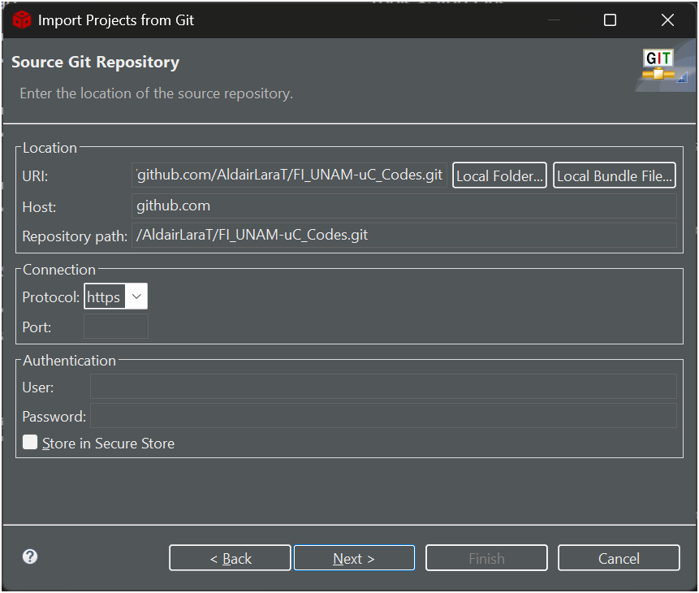
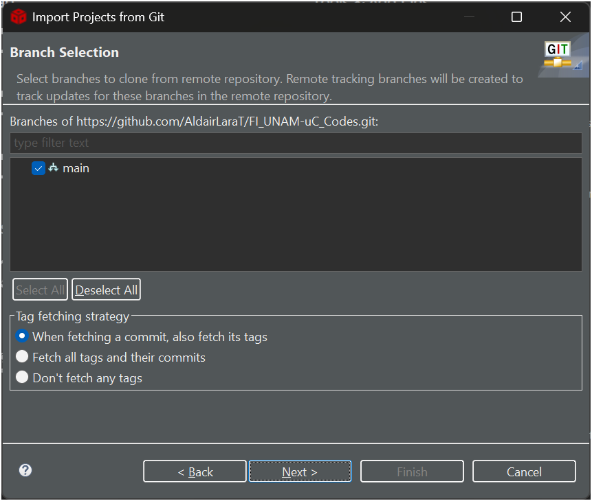
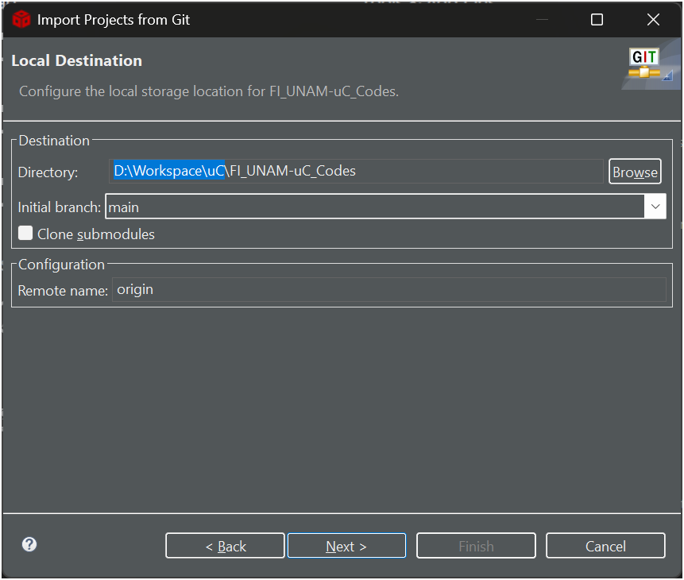
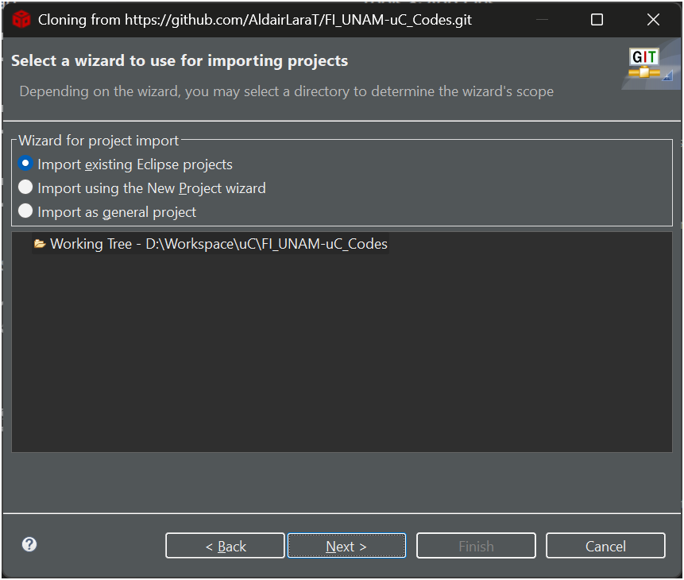

# Curso de microprocesadores y Microcontroladores
Repositorio de apoyo para el curso de Microprocesadores y Microcontroladores, impartido en la Facultad de Ingeniería, UNAM.

---
# Dirigido a
Estudiantes de la Facultad de Ingeniería, UNAM, que cursan las carreras de:
- Ingeniería Eléctrica Electrónica.
- Ingeniería Aeroespacial.
- Ingeniería Mecatrónica.

---
# Contenido
- Códigos de ejemplo y ejercicios relacionados con la asignatura.
- [Manuales, presentaciones y material del curso](MATERIAL.md).

---
# Importar el repositorio en Code Composer Studio

1. Crear un nuevo `workspace` en *Code Composer Studio*.

2. `File` >> `Import` >> `Git` >> `Projects from Git` >> `Clone URI`.

3. En `URI`, pegar el url `https://github.com/AldairLaraT/FI_UNAM-uC_Codes.git` y seleccionar `Next`.

4. Con la siguiente configuración, seleccionar `Next`.

5. Seleccionar el directorio del `workspace` (automáticamente se agregará la ruta `FI_UNAM-uC_Codes`), clic en `Next`.

6. Con la siguiente configuración, seleccionar `Next`.

7. En la siguiente ventana, seleccionar `Finish`.

---
# Actualizar el repositorio a la versión más reciente
1. Clic derecho en el `Project Explorer` >> `Team` >> `Pull`.

2. `File` >> `Import` >> `Code Composer Studio` >> `CCS Projects`.

3. Seleccionar el directorio del `workspace` >> `Select All` >> `Finish`.

---
# Contacto
**Autor:** M. I. Christo Aldair Lara Tenorio

**Correo:** aldairlara.fi@gmail.com

**Cubículo:** Laboratorio de Instrumentación Electrónica de Sistemas Espaciales (LIESE), 2do piso del edificio P, Conjunto Sur de la Facultad de Ingeniería, UNAM.

**Horario:**
| Horario         |    Lunes     | Martes  |  Miércoles   |    Jueves    | Viernes  |
|:---------------:|:------------:|:-------:|:------------:|:------------:|:--------:|
| 11:00h - 12:00h | -            | -       | -            | -            | -        |
| 12:00h - 13:00h | LIESE        | Reunión | Reunión      | LIESE        | Variable |
| 13:00h - 14:00h | Reunión      | LIESE   | LIESE        | Clase (Q106) | Variable |
| 14:00h - 15:00h | Reunión      | LIESE   | LIESE        | Clase (Q106) | Variable |
| 15:00h - 16:00h | -            | -       | -            | -            | -        |
| 16:00h - 17:00h | LIESE        | Reunión | LIESE        | LIESE        | Reunión  |
| 17:00h - 18:00h | Clase (Q102) | LIESE   | Clase (Q102) | LIESE        | Variable |
| 18:00h - 19:00h | Clase (Q102) | Reunión | Clase (Q102) | LIESE        | Variable |
| 19:00h - 20:00h | LIESE        | LIESE   | LIESE        | LIESE        | Variable |
| 20:00h - 21:00h | -            | -       | -            | -            | -        |

---
# Requisitos del curso
**IDE:** [Code Composer Studio (CCS) de Texas Instruments](https://www.ti.com/tool/download/CCSTUDIO/12.8.1).

**Versión:** 12.8.1 (Sep 30, 2024).

**Tarjeta de desarrollo:** [EK-TM4C1294XL Evaluation board](https://www.ti.com/tool/EK-TM4C1294XL).

---
# Códigos del repositorio
| Código | Nombre                                                                               | Lenguaje | Tema                                                           |
|:------:|:-------------------------------------------------------------------------------------|:--------:|:---------------------------------------------------------------|
| `c01`  | Instrucciones básicas del ARM Cortex-M: MOV                                          | `asm`    | `T03` Modos de direccionamiento y conjunto de instrucciones    |
| `c02`  | Instrucciones básicas del ARM Cortex-M: ADD                                          | `asm`    | `T03` Modos de direccionamiento y conjunto de instrucciones    |
| `c03`  | Instrucciones básicas del ARM Cortex-M: LDR                                          | `asm`    | `T03` Modos de direccionamiento y conjunto de instrucciones    |
| `c04`  | Instrucciones básicas del ARM Cortex-M: B                                            | `asm`    | `T03` Modos de direccionamiento y conjunto de instrucciones    |
| `c05`  | Tarea 3: Código básico en lenguaje ensamblador                                       | `asm`    | `T03` Modos de direccionamiento y conjunto de instrucciones    |
| `c06`  | Instrucciones del procesador ARM Cortex-M4F: Acceso a memoria                        | `asm`    | `T03` Modos de direccionamiento y conjunto de instrucciones    |
| `c07`  | Instrucciones del procesador ARM Cortex-M4F: Procesamiento de da                     | `asm`    | `T03` Modos de direccionamiento y conjunto de instrucciones    |
| `c08`  | Instrucciones del procesador ARM Cortex-M4F: Multiplicación y división               | `asm`    | `T03` Modos de direccionamiento y conjunto de instrucciones    |
| `c09`  | Instrucciones del procesador ARM Cortex-M4F: Salto y control                         | `asm`    | `T03` Modos de direccionamiento y conjunto de instrucciones    |
| `c10`  | Programa fuente vs programa objeto                                                   | `asm`    | `T04` Lenguaje ensamblador y el ensamblador                    |
| `c11`  | Programa en lenguaje ensamblador                                                     | `asm`    | `T04` Lenguaje ensamblador y el ensamblador                    |
| `c12`  | Estructuras de control: IF                                                           | `asm`    | `T05` Programación estructurada en lenguaje ensamblador        |
| `c13`  | Estructuras de control: IF-ELSE                                                      | `asm`    | `T05` Programación estructurada en lenguaje ensamblador        |
| `c14`  | Estructuras de control: SWITCH-CASE                                                  | `asm`    | `T05` Programación estructurada en lenguaje ensamblador        |
| `c15`  | Estructuras de control: WHILE                                                        | `asm`    | `T05` Programación estructurada en lenguaje ensamblador        |
| `c16`  | Estructuras de control: DO-WHILE                                                     | `asm`    | `T05` Programación estructurada en lenguaje ensamblador        |
| `c17`  | Estructuras de control: FOR                                                          | `asm`    | `T05` Programación estructurada en lenguaje ensamblador        |
| `c18`  | Variables y pase de parámetros                                                       | `asm`    | `T05` Programación estructurada en lenguaje ensamblador        |
| `c19`  | Control de los LED de usuario                                                        | `asm`    | `T06` Puertos de entrada/salida                                |
| `c20`  | Retardos con lenguaje ensamblador                                                    | `asm`    | `T06` Puertos de entrada/salida                                |
| `c21`  | Control de un LED con un SW de usuario                                               | `asm`    | `T06` Puertos de entrada/salida                                |
| `c22`  | Control de un LED con un SW de usuario sin debounce                                  | `asm`    | `T06` Puertos de entrada/salida                                |
| `c23`  | Control de un LED con un SW de usuario con debounce                                  | `asm`    | `T06` Puertos de entrada/salida                                |
| `c24`  | Conmutación de un LED empleando el SysTick en modo multi-shot                        | `asm`    | `T06` Puertos de entrada/salida                                |
| `c25`  | Conmutación de un LED empleando el SysTick en modo one-shot                          | `asm`    | `T06` Puertos de entrada/salida                                |
| `c26`  | Estructuras de control: IF                                                           | `C`      | `T08` Lenguaje C                                               |
| `c27`  | Estructuras de control: IF-ELSE                                                      | `C`      | `T08` Lenguaje C                                               |
| `c28`  | Estructuras de control: SWITCH-CASE                                                  | `C`      | `T08` Lenguaje C                                               |
| `c29`  | Estructuras de control: WHILE                                                        | `C`      | `T08` Lenguaje C                                               |
| `c30`  | Estructuras de control: DO-WHILE                                                     | `C`      | `T08` Lenguaje C                                               |
| `c31`  | Estructuras de control: FOR                                                          | `C`      | `T08` Lenguaje C                                               |
| `c32`  | Control de los LED de usuario                                                        | `C`      | `T08` Lenguaje C                                               |
| `c33`  | Control de un LED con un SW de usuario                                               | `C`      | `T08` Lenguaje C                                               |
| `c34`  | Control de un LED con un SW de usuario sin debounce                                  | `C`      | `T08` Lenguaje C                                               |
| `c35`  | Control de un LED con un SW de usuario con debounce                                  | `C`      | `T08` Lenguaje C                                               |
| `c36`  | Conmutación de un LED empleando el SysTick en modo multi-shot                        | `C`      | `T08` Lenguaje C                                               |
| `c37`  | Conmutación de un LED empleando el SysTick en modo one-shot                          | `C`      | `T08` Lenguaje C                                               |
| `c38`  | Control de un LED con un SW de usuario con interrupción                              | `C`      | `T07` Interrupciones y resets                                  |
| `c39`  | Control de un contador con los SW de usuario, empleando interrupciones               | `C`      | `T07` Interrupciones y resets                                  |
| `c40`  | Control de los LED de usuario (modular)                                              | `C`      | `T09` Periféricos                                              |
| `c41`  | Control de un LED con un SW de usuario (modular)                                     | `C`      | `T09` Periféricos                                              |
| `c42`  | Control de un LED con un SW de usuario sin debounce (modular)                        | `C`      | `T09` Periféricos                                              |
| `c43`  | Control de un LED con un SW de usuario con debounce (modular)                        | `C`      | `T09` Periféricos                                              |
| `c44`  | Conmutación de un LED empleando el SysTick en modo multi-shot (modular)              | `C`      | `T09` Periféricos                                              |
| `c45`  | Conmutación de un LED empleando el SysTick en modo one-shot (modular)                | `C`      | `T09` Periféricos                                              |
| `c46`  | Control de un LED con un SW de usuario con interrupción (modular)                    | `C`      | `T09` Periféricos                                              |
| `c47`  | Control de un contador con los SW de usuario, empleando interrupciones (modular)     | `C`      | `T09` Periféricos                                              |
| `c48`  | Convertidor analógico digital (ADC)                                                  | `C`      | `T09` Periféricos                                              |
| `c49`  | Convertidor analógico digital (ADC): Sensor de temperatura                           | `C`      | `T09` Periféricos                                              |
| `c50`  | Convertidor analógico digital (ADC): Multicanal                                      | `C`      | `T09` Periféricos                                              |
| `c51`  | Convertidor analógico digital (ADC): Interrupción                                    | `C`      | `T09` Periféricos                                              |
| `c52`  | Módulo temporizador de propósito general (GPTM): 16bits, one-shot                    | `C`      | `T09` Periféricos                                              |
| `c53`  | Módulo temporizador de propósito general (GPTM): 16bits, one-shot, interrupción      | `C`      | `T09` Periféricos                                              |
| `c54`  | Módulo temporizador de propósito general (GPTM): 32bits, one-shot, interrupción      | `C`      | `T09` Periféricos                                              |
| `c55`  | Módulo temporizador de propósito general (GPTM): 32bits, periodic, interrupción      | `C`      | `T09` Periféricos                                              |
| `c56`  | Módulo temporizador de propósito general (GPTM): Pulse Width Modulation (PWM)        | `C`      | `T09` Periféricos                                              |
| `c57`  | Universal Asynchronous Receiver/Transmitter (UART)                                   | `C`      | `T09` Periféricos                                              |
